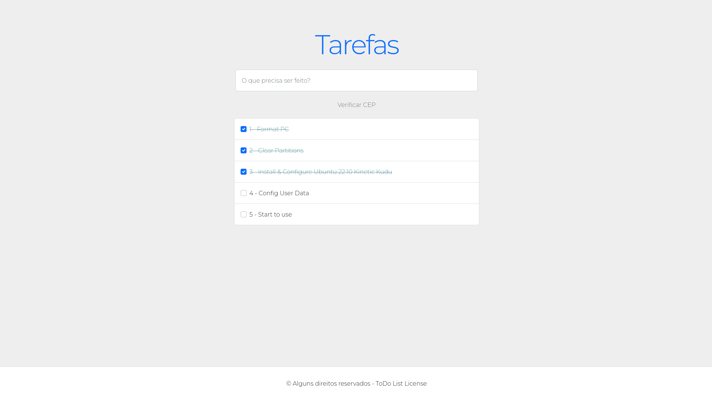

<h1 align="center"> To Do List - Vue.js [Casa do Código / Alura]</h1>

<p align="center">
  Projeto de To Do List e API CEP com Vue.js baseado no livro **Vue.js - construa aplicações incríveis**, do autor Caio Incau e editado pela Casa do Código / Alura.
</p>

<br>

<p align="center">
  
</p>

## 🚀 Tecnologias

Esse projeto foi desenvolvido com as seguintes tecnologias:

- [Vue.js](https://vuejs.org/)
- [Vuex](https://vuex.vuejs.org/)
- [Vue Router](https://router.vuejs.org/)

## 💻 Projeto

ToDo List é um dos exemplos mais comuns de todo programador: um mini sistema que adiciona, edita e remove itens de uma lista para fazer ou não.

<h1 align="center"> Setup Fron-end & Back-end</h1>

## 🔥 Front-end

Instale as dependências do projeto:

```
npm install
```

Rode a aplicação:

```
npm run dev
```

ou

```
npm run build
```

<br /><br /><br />

<h4 align="center">
 
  <br />
  Feito com ♥ no Ubuntu 22.04 LTS
</h1>
